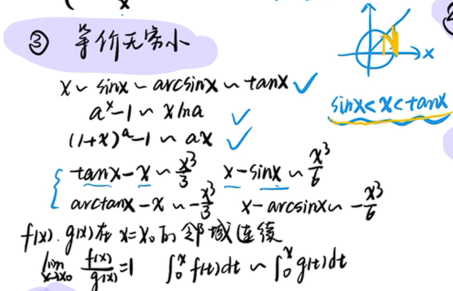
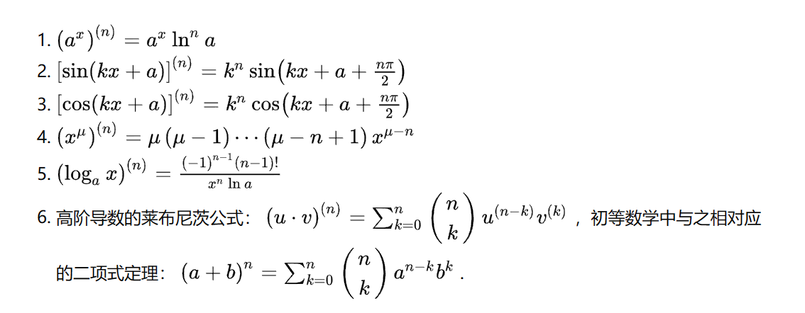

## 数列的极限
注：仅节选重点部分

### 收敛数列的性质

1. 唯一性：极限唯一
2. 局部有界性
3. 局部保号性：n>N时，$x_n$的符号与极限相同
	- 推论：反过来说，如果n>N0(某个值时)，使得$x_n\geqslant0$或者$x_n\leqslant0$，那么极限的符号就和$x_n$相同
4. 数列极限与子数列极限的关系：收敛数列的任一子数列收敛于同一极限

## 函数的极限

### 函数极限的性质

1. 唯一性
2. 局部有界性：假设x->x0时有极限a，那么局部就指的是x0的邻域
3. 局部保号性
	- 更强的局部保号性：假设极限为A，即$|f(x)-A|<\epsilon$，若$\epsilon$取A/2，可得$|f(x)|>|A/2|$
	- 推论：反过来说即可
4. 函数极限与数列极限的关系

## 极限存在准则

### 1.夹逼准则
证明中学到了几个不等式：$sinx<x<tanx、0<1-cosx<x^2/2$

### 2.数列的判断
1. 单调有界 == 有极限
2. 柯西审敛原理（充要条件）：若存在m>N，n>N，那么就有$|x_n-x_m|<\epsilon$

### 3.函数的判断

1. 左邻域单调有界 == 有左极限

## 极限运算法则

### 1.基本运算

1. 有限个无穷小之和=无穷小
2. 有限个无穷小之积=无穷小
3. 有界函数x无穷小=无穷小 
4. 若两个函数存在极限：f(x)->a，g(x)->b，那么可以进行四则运算（但记得保证分式的分母!=0）

5. 若函数是连续的，那么可以把外层的lim传到内层，参见<连续函数性质>一节
6. 若f(x)->a，g(x)->b，且f(x)>=g(x)，那么可得a>=b

### 2.复杂运算的技巧

1. 多项式或有理分式直接代入法
2. 倒数法：若$\lim f(x)$难求，可以先求$\lim \frac{1}{f(x)}$
3. 有理分式因式分解
4. 0/0或者∞/∞：抓大头法或者洛必达
5. 倒代法：令t=1/x，试图将某些项化成无穷小

## 无穷小的比较

### 1.等价无穷小
1. 充要条件：a与b是等价无穷小 <==> b=a+o(a)
2. 应用：|f(x)-A|<ε <=\=> lim f(x)=A <=\=> f(x)=A+无穷小
3. 分式或乘积中的无穷小可以替换成其他的等价无穷小，但和差中的无穷小不能替换 

### 2.等价无穷小公式

### 3.幂指函数的计算

1. 当底数和指数均有极限时：采用对数变换法，即$\lim x^{sinx} = \lim e^{ln(x)sinx} = e^{\lim ln(x)sinx}$

2. $1^\infty$形式：采用等价无穷小，即$ \lim\limits_{x\rightarrow 0} (1+x)^\frac{1}{x} $ ~ $e$（底数是其他常数可以先凑1）

3. $\infty^0$形式：采用等价无穷小，即$ \lim\limits_{x\rightarrow \infty} (1+x)^\frac{1}{x} $ ~ $1$，拓展：$ \lim\limits_{x\rightarrow \infty} x^\frac{1}{x}$~$1$

4. 幂函数：$\lim\limits_{x \rightarrow \infty}x^n$，$|x|<1时极限=0$，$|x|>1时极限=\infty$，$x=1时极限=1$，$x=-1时极限不存在$

## 函数的连续与间断、可导与不可导、可积与不可积

一元函数：(可微<=\=>可导)=\=>连续=\=>可积

多元函数（本章未提及）：(可微<=\=>可方向导)=\=>可偏导=\=>连续=\=>可积

### 1.连续与间断

#### 点连续

1. **左右极限存在且相等**（极限存在且相等），且**极限值与函数值相等**（极限==函数值）：
- limf(x0-) = limf(x0+) = f(x0)

#### 点间断
1. 函数极限存在：
	- 可去间断（相等）：limf(x0-) = limf(x0+) != f(x0)
	- 跳跃间断（不相等）：limf(x0-) != limf(x0+)
2. 左右极限只要有一个为无穷，即极限不存在：
	- 无穷间断：limf(x0-)=∞ 或者 limf(x0+)=∞
3. 来回震荡，即极限不存在：
	- 震荡间断

### 2.可导与不可导

#### 可导
1. 左右导数存在：
	- 左导数=右导数
2. 由1推知，可导一定连续，连续不一定可导

### 3.可积与不可积

#### 不定积分的可积
1. 原函数存在定理：连续函数必有原函数
2. 由1可知，连续一定可积

#### 定积分的可积
1. 函数在==闭区间上==连续，则在该区间上可积
2. 函数在==闭区间上==仅含有限个间断点，则该区间上可积
3. 由1、2可知，连续一定可积，间断不一定可积

### 4.连续函数性质

#### 连续函数的四则运算
1. 一切初等函数在其定义区间内都是连续函数
2. 连续函数的四则运算结果都是连续函数

#### 连续函数的反函数和复合函数
1. 函数与反函数的单调性和连续性一致
2. 复合函数中连续性可以传递：部分传到整体，若g(x)在x0连续，且g(x0)=u0，而f(u)在u0连续，那么f[g(x)]这个整体就连续
3. 复合函数的lim可以传递：从外往内传，即lim f[ g(x) ] = f[ lim g(x) ]，反之（由内向外传）也可以。

#### 重点：<闭区间连续>的函数的性质（闭连性质）

1. 有界性：在闭区间上有界

2. 最大值最小值定理：一定有最大值和最小值

3. 零点定理：若$f(a) \times f(b)<0$，那么对于ab之间的一点，即(a，b)的某点a，有f(a)刚好等于0

4. 介值定理

5. 推论

6. 闭连性质的应用：证明函数存在至少一个根、中值定理的条件之一

## 导数

### 1.分段函数的题型注意点
假设f(x)：在x<=0时为$e^{ax}$，在x>0时为$b(1-x^2)$，条件是f(x)在R上可导。

在证明中会得到f(x)在x=0上可导的条件，转而去求证$f'(0^-)=f'(0^+)=f'(0)$。

x=0时会选用f(x)=$e^{ax}$，其定义域为(-∞，0]，因此通过**这个解析式求导**可以直接得到f’(0-)=f’(0)=0。

但是得不到0的右导数，因为0的右导数已经超过了右边的表达式（即$b(1-x^2)$）的定义域范围了，**不能直接对右边的表达式求导**，所以为了求到右导数，请用导数的定义式去求解。

### 2.导数基本公式

补充：
1. $y=secx则y'=secxtanx$
2. $y=cscx则y'=-cscxcotx$
3. $y=tanx则y'=sec^2x$
4. $y=cotx则y'=-csc^2x$

记忆：
三角函数的导数中，带c的导数是负数，带s的导数是正数。
三角函数的积分中，带c的积分是正数，带s的积分是正数。

### 3.高阶导数中的n次求导公式

其中，对于第4点中的这个幂函数：
1. k<n时才是这个式子
2. k=n时，原式=n!
3. k>n时，原式=0

### 4.隐函数求导
1. 如果等式两边对x求导，那么就令y=y(x)，即把y看成x的函数，那么可得x的导数=1，y的导数=y'
2. 如果等式两边对其他变量t求导，那么令y=y(t)，x=x(t)
3. 幂指函数的求导：如果需要求导的函数中，如果遇见比较难求的函数（如幂指函数求导$y=x^{sinx}$），可用对数变换法变换后，再运用隐函数求导

## 微分

### 1.在近似计算中的应用
1. 基本近似公式1——适用于==估计==变化后的函数值$f(x_0+\Delta x)$：
	因为$\frac{\Delta y}{\Delta x}=\frac{f(x_0+\Delta x)-f(x_0)}{\Delta x}\approx f'(x_0)$，而且只有取lim的时候约等于才会变成等于，
	所以$f(x_0+\Delta x)\approx f'(x_0)\Delta x+f(x_0)$
2. 基本近似公式2——适用于==估计==变化时的变化量$\Delta y$：
	$\Delta y \approx dy = f'(x)\Delta x = f'(x)dx$

1. 基本近似公式1的运用举例——求导+凑$\Delta x$：
    如$cos(29°)=cos(30°+(-1°))$，这里的$(-1°)$就是$\Delta x$，代入公式即可。注意，选用$\Delta x$时，$|\Delta x|$要尽可能小。
2. 基本近似公式2的运用——仅求导即可。

1. 拓展近似公式——基本求导公式的：
    令$x_0=0，\Delta x=x$，那么近似公式就变为$f(x)\approx f(0)+f'(0)x$

2. 拓展用法的运用——$|x|$较小时才能用：
    前提条件是|x|较小，这样才可以令$x_0\to 0$，才能使用拓展近似公式。
    如证明$\sqrt[n]{1+x} \approx 1+\frac{1}{n}x$

### 2.微分中值定理

#### a.费马引理（函数最值或极值点 <=> 导数为零）
1. 假设f(x)在$x_0$的邻域有定义，并且在$x_0$处可导。如果$f(x_0)$取得这个邻域的最值，即如果对任意的$x\in U(x_0)$，存在$f(x_0)\ge f(x)或者f(x_0)\le f(x)$的关系，那么可得$f'(x)=0$。
2. 上述条件可以简单记忆为“邻域的最值点 == 函数的最值或极值点 ==> 导数为零”
3. 注：是邻域这个极小范围的最值，不代表整个函数的最值，其实就是指函数的最值或极值。参见<函数极值-费马引理叙述变化>一节

#### b.罗尔定理（闭连、开导、两等）

1. 该定理由费马引理导出。
2. 使用条件：闭区间$[a,b]$连续，开区间$(a,b)$可导，区间端点函数值相等$f(a)=f(b)$（闭连、开导、两等）
3. 内容：满足条件的f(x)至少存在一个$\xi \in (a,b)$，使得$f'(x)=0$
4. 应用：判断函数的导数在某个区间内至少有几个零点；如果求出函数f的原函数g，就可以对g使用罗尔定理，判断g的导数，即f，至少有几个零点。

#### c.拉格朗日中值定理（闭连、开导）

1. 由罗尔定理推出，但限制条件更少。
2. 使用条件：闭区间$[a,b]$连续，开区间$(a,b)$可导（闭连、开导）
3. 内容：满足条件的f(x)至少存在一个$\xi \in (a,b)$，使得$f(b)-f(a)=\Delta y=f'(\xi)(b-a)$
4. 上述内容可利用几何意义，简单记忆为“函数上至少存在一点$\xi$，使得该点切线斜率=区间割线斜率”，即$f'(\xi)=\frac{f(b)-f(a)}{b-a}$，然后将b-a乘过去即可
5. 推论（常数定理）：满足闭连开导的函数，如果区间内导数恒为0（注：区间的端点是没有导数的），那么f(x)在该区间内是一个常数

###### 基本应用
如证明$\frac{x}{1+x}<ln(1+x)<x$。
可以将1视作$x_0$，x视作$\Delta x$，构造$F(x)=lnx,F'(x)=\frac{1}{x},\xi\in(1,1+x)$。
那么$ln(1+x)=ln(1+x)-ln1=F(1+x)-F(1)$，
由拉格朗日中值定理知：$F(1+x)-F(1)=F'(\xi)x=\frac{x}{\xi}$，
因为$\xi\in(1,1+x)$，
所以$\frac{x}{1+x}<ln(1+x)<x$得证。

###### 有限增量公式
1. 设$x$是[a，b]中的一点，$x+\Delta x$就是[a，b]中的另外一点，那么在开区间$(x,x+\Delta x)$上存在一点$\xi$，由拉格朗日中值定理知，存在一点$f(x+\Delta x)-f(x)=\Delta y=f'(\xi)(x+\Delta x -x)=f'(\xi)\Delta x$
2. 上式中$\xi$是开区间$(x,x+\Delta x)$内的一点，因此又有$\xi=x+\theta\cdot\Delta x$

3. 综合1、2，当我们得到$\Delta x$的值后，又需要$\Delta y$的==精确表达式==时：$\Delta y=f'(x+\theta\Delta x)\cdot\Delta x$

#### d.柯西中值定理（闭连、开导、不等）
1. 在==记忆中==可以记成：两个函数算出拉格朗日中值公式，再将两个公式相除得到的
2. 但==实际上==它是由罗尔定理推出的，因为单纯用拉格朗日中值公式再相除的话，$f(\xi)$和$F(\xi)$中的两个$\xi$其实是不同的两个变量，而不是实际公式中的两个相同的$\xi$
3. 使用条件：闭区间$[a,b]$连续，开区间$(a,b)$可导，区间内分母导数不等于0，即$(a,b)区间内，F'(\xi)\not=0$（闭连、开导、不等）
4. 内容：$\frac{f(a)-f(b)}{F(a)-F(b)}=\frac{f'(\xi)}{F'(\xi)}$

## 洛必达

### 1.$\frac{0}{0}$型

### 2.$\frac{\infty}{\infty}$型

### 3.$\frac{0}{0}$型

### 4.$0\cdot\infty$型

### 5.$\infty-\infty$型

通分为有理分式，再洛必达。

注：反常积分中，常会出现$\infty-\infty$，但根据其定义，只要有一项为无穷，整个积分就是发散的，所以在反常积分中遇到这个形式请不要直接洛必达。

### 6.$1^{\infty}$型——$0^0$型——$\infty^0$型

一般指幂指函数的计算，可以参考<无穷小的比较-幂指函数的计算>一节

### 7.注意：没有$0^{\infty}$型

在<极限运算法则-基本运算>提到，有限个无穷小之积为无穷小，但是==无穷个 无穷小之积 不一定为无穷小==！！

## 函数单调性、凹凸性

### 1.用导数判断单调性
#### a.增函数相关

1. $一阶导>0$ ==> 函数增
2. 函数增 ==> $一阶导\ge0$
#### b.减函数相关
3. $一阶导<0$ ==> 函数减
4. 函数减 ==> $一阶导\le0$

### 2.用几何判断凹凸性

#### a.割线中点较高——凹函数
$\frac{f(x_1)+f(x_2)}{2}>f(\frac{x_1+x2}{2})$

左式实际上是割线中点A的纵坐标，而右式是在函数上的、与A横坐标相同的点B的纵坐标。
这里的$y_A>y_B$就表示函数上的点在下方，因此为下凸函数（凹函数）

#### b.割线中点较低——凸函数
$\frac{f(x_1)+f(x_2)}{2}<f(\frac{x_1+x2}{2})$

同理，这里的$y_A<y_B$就表示函数上的点在上方，因此为上凸函数（凸函数）

### 3.用导数判断凹凸性

1. 二阶导>0 ==>凹函数
2. 二阶导<0 ==>凸函数
3. 注：一阶导>0的函数是增函数，二阶导>0的函数是凹函数。所以可以将“增减”和“凹凸”对应来记忆

### 4.凹凸函数的特殊性质——$jensen$不等式

若权重之和=1，即$\sum^n_{i=1}q_i=1$

#### 对于凹函数f(x)

$\sum^n_{i=1}f(q_ix_i) \le \sum^n_{i=1}q_if(x_i)$

#### 对于凸函数f(x)

$\sum^n_{i=1}f(q_ix_i) \ge \sum^n_{i=1}q_if(x_i)$

## 函数极值

### 1.费马引理叙述变化

1. 在之前的学习中概括如下：邻域最值点$x_0$的导数为零。
2. 1中的“邻域最值”，是指“$x_0$的邻域”这个极小范围的最值，不代表整个函数的最值。
3. 现在可以更新叙述：函数极值点$x_0$的导数为零。
4. 或者叙述为“函数极值点 <=\=> 邻域最值点 =\=> 驻点”，注意到，这里其实是==必要条件==。

### 2.极值的判断

#### 第一充分条件（找$x_0$左右邻域的一阶导）

注：该方法不关心$x_0$有没有导数，只关心它左右邻域的增减性。

假设函数在$x_0$点连续，且在$x_0$的去心邻域内可导：
1. 左邻域中一阶导>0 + 右邻域中一阶导<0 ==> 极大值点（↗$x_0$↘）
2. 左邻域中一阶导<0 + 右邻域中一阶导>0 ==> 极小值点（↘$x_0$↗）

#### 第二充分条件（找$x_0$的二阶导）

注：该方法不关心它的左右邻域，只关心$x_0$的导数。其中，$x_0$的一阶导为0 ==> $x_0$是极值点。但只有$x_0$的二阶导不为0的时候，$x_0$才是极值点。

假设函数在$x_0$点处==一阶导为0==，且具有二阶导：

1. 二阶导>0 ==> 极小值
2. 二阶导<0 ==> 极大值
3. 注意：大于0的时候，反而是极小值；小于0的时候，反而是最大值。

## 曲率

### 1.弧微分

#### a.参数方程下的弧微分

假设有$f(n)=\begin{cases}x=\varphi(t)\\y=\psi(t)\end{cases}$

则==弧微分==$ds=\sqrt{(dx)^2+(dy)^2}=\sqrt{\varphi'^2(t)+\psi'^2(t)}\cdot dt$

#### b.直角坐标系下的弧微分

$ds=\sqrt{(dx)^2+(dy)^2}=\sqrt{1+y'^2}\cdot dx$

简便起见，设$T=\sqrt{1+y'^2}$，则==弧微分==$ds=T\cdot dx$

#### c.极坐标系下的弧微分

假设有$\rho=\rho(\theta)$

可通过$\begin{cases}  x=x(\theta)=\rho(\theta)\cdot cos\theta  \\  y=y(\theta)=\rho(\theta)\cdot sin\theta  \end{cases}$==转换到参数方程下==的弧微分计算中，

即$ds=\sqrt{(dx)^2+(dy)^2}=\sqrt{x'^2(\theta)+y'^2(\theta)}\cdot d\theta$

最终==弧微分==$ds=\sqrt{\rho^2(\theta)+\rho'^2(\theta)}\cdot d\theta$

### 2.曲率与曲率半径

#### 曲率$K$

1. 平均曲率：$\overline{K}=|\frac{\Delta \alpha}{\Delta s}|$

2. 曲率：

   在直角坐标系下：
   为简便起见，设$T=\sqrt{1+y'^2}$，

   则$K=lim\overline K=\frac{|y''|}{T^3}$

#### 曲率圆

曲率圆的圆心$D$叫做曲率中心，半径$\rho$叫做曲率半径。

#### 曲率半径$\rho$

经过计算，发现$\rho=\frac{1}{K}和K=\frac{1}{\rho}$，即曲率半径与曲率互为倒数。

## 不定积分

### 1.不定积分的性质

1. 线性可加性
2. 被积函数中的常数和无关变量，可以提出去

### 2.检验积分结果的正确性

将结果（即求得的原函数）求导，将导数与被积函数比较，结果一致则正确。

### 3.计算技巧

#### a.凑微分
- $sin^nx \cdot cos^mx$型

- $tan^nx \cdot sec^mx$型

#### b.变量换元法

- 三角换元

  用法：凑平方差或者平方和：$(ax+b)^2\pm c^2$，令$x=asint、atant、\pm asect$，并替换被积函数中的x

  作用：消去根式、消去高次幂

- 根式代换

  用法：根式下是一次函数时，直接令t=根式，反解出x=x(t)，并替换被积函数中的x

  作用：消去根式

- 倒代换

  用法：分母次数高时，直接令$x=\frac{1}{t}$，并替换被积函数中的x

  作用：消去被积函数分母中的变量因子x，降低分母次数

- 半角代换（也叫万能换元法、以切表弦法）

#### c.分部积分法

- 口诀：反对幂三指，越靠前的函数，不移动位置的优先级就越大
$e^x$型：
- $\int x^ke^x\cdot dx$
- $\int sinxe^x\cdot dx$（解方程）
- $\int e^{\sqrt[k]{x}}\cdot dx$（根式换元）

$lnx$型（令$u=ln^kx，反解出x=x(u)$，替换被积函数的x之后，即可转换为$e^x$型）
- $xlnx\cdot dx$
- $ln^kx\cdot dx$

#### d.有理函数的积分

- 假分式化为真分式
- 真分式的分母$\Delta>0$：分解因式，转换成$(x-a)^k$相乘
- 真分式的分母$\Delta<0$：拼凑法
  1. 用待定系数法，将分式整体拆成几个分式
  2. 分子往分母的导数上面凑
  3. 分母化成平方和，往三角函数的导数形式上凑
  4. 分母化成平方差，逆用平方差公式从而因式分解
  5. 分母化成平方和或者平方差，用三角换元
  
  

## 定积分

定义公式（重要）：

$$\int_a^b{f(x)dx} = \lim\limits_{n\to\infty} \sum_{i=1}^n {f(a+(b-a)\cdot \frac{i}{n})[(b-a)\cdot \frac{1}{n}]}$$

$$\int_0^1{f(x)dx} = \lim\limits_{n\to\infty} \sum_{i=1}^n {f(\frac{i}{n})\cdot\frac{1}{n}}$$（这个一定要记）

注意：求定积分前，先在区间内找瑕点，若含有瑕点，则这个积分一定是无界积分（即瑕积分）；否则是普通积分或者无穷限积分，处理方法不同。

### 普通（广义）积分（上下限不为无穷）

#### 性质
1. 正规性（对1求积分，结果是b-a）

2. 线性可加性

3. 区间可加性

4. 保号性（被积函数大于零则积分大于零，小于零则积分小于零）

5. 保序性（函数1大于函数2，则对应的积分1大于积分2，反之同理）

6. 绝对值不等式（整个积分的绝对值 <= 函数绝对值的积分。因为函数先取绝对值会使得原本的负面积变为正面积，再积分的话就要大一些，当然如果函数本身没有负面积，那么积分后就没有变化）

7. 估值不等式（如果函数小于max，大于min，那么其积分小于max\*(b-a)，大于min\*(b-a)）

8. 积分中值定理（仅要求闭连条件，因为与导数无关，所以不需要开导的条件。积分一定存在一个中值=$f(\xi)(b-a),(a\le \xi \le b)$）

#### 计算技巧（反常积分不能用！！）
1. 偶倍奇零（在==对称区间上==函数为偶函数或者奇函数）

2. 原偶积奇（原函数是偶函数时，对应积分上限函数就是奇函数，反之同理）

3. $f(sinx)$和$f(cosx)$的积分在$[0,\frac{\pi}{2}]$区间是一样的

4. 快速消去$xf(sinx)$的积分中的x，积分变为原来的$\frac{\pi}{2}$倍（==特别注意，这里的积分区间==是$[0,\pi]$)

5. 对一个周期为T的函数来说，只要积分的区间长度=T，那么这些积分都是一样的

6. 对一个周期为T的函数来说，积分区间为$[a,a+nT]$时，其含义相当于n个区间长度为T的积分之和，又因为这n个积分的区间长度都是T（它们都是一样的积分），所以$[a,a+nT]$区间的积分=n\*区间长度为T的积分

7. 高次三角函数的积分——点火公式（积分区间是$[0,\frac{\pi}{2}]$）

### 反常积分
略
